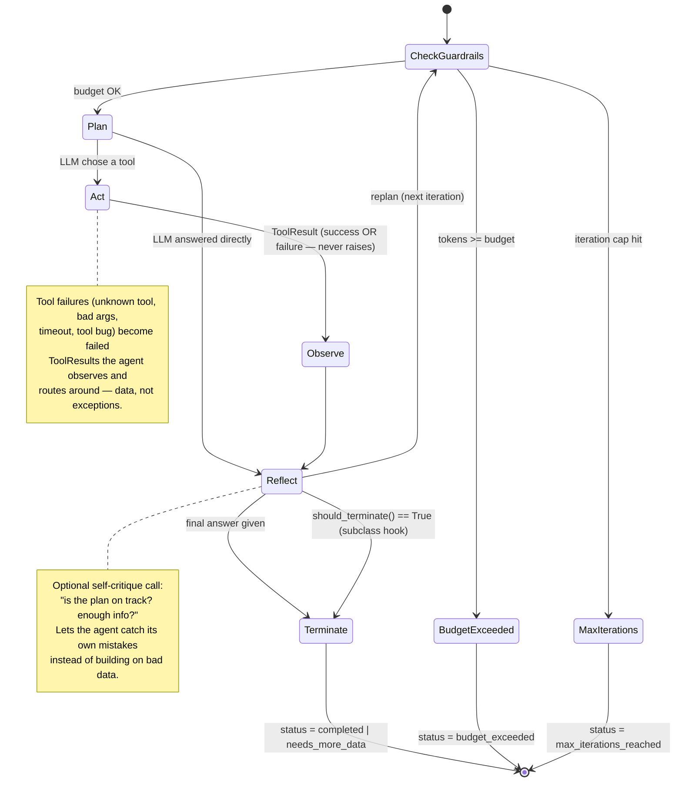
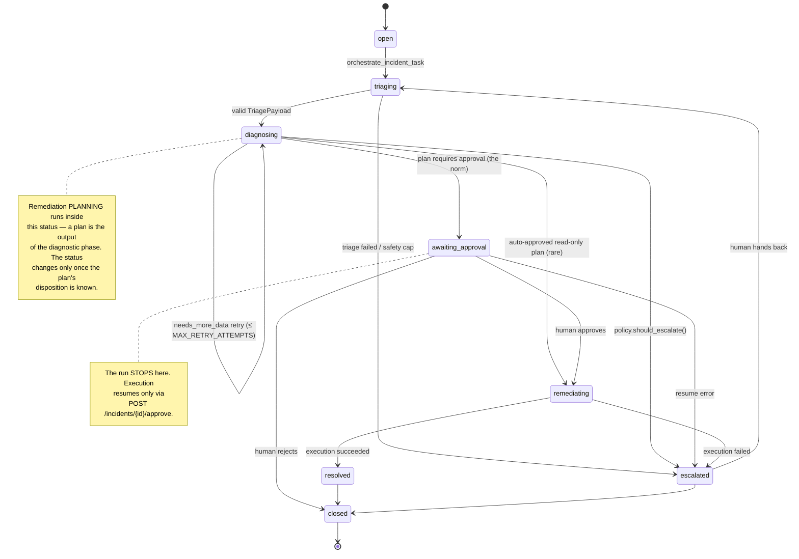

# SentinelOps

**Autonomous multi-agent incident response platform** — an AI SRE copilot that ingests
infrastructure alerts, triages severity, diagnoses root cause, proposes a remediation
plan, and (only with human approval) executes it.

> Status: **Stage 9 — React dashboard.** Live incident feed, a WebSocket trace
> panel showing every agent's plan/act/observe/reflect steps as they happen,
> and the human approval gate as a clickable dialog.

## Architecture at a glance

```
Alert/Log Ingestion
        │
        ▼
   Orchestrator ──────────────────────────────┐
    │  (dynamic planning, agent routing)       │
    ▼                                          │
 Triage Agent → Diagnostician Agent → Remediation Planner Agent
    │                  │                        │
    └──── writes to Working Memory (per-incident scratchpad) ────┘
                       │
         ┌─────────────┴─────────────┐
         ▼                            ▼
  Episodic Memory (past          Semantic Memory
  incidents + outcomes,          (runbooks, docs,
  vector store)                  vector store)
                       │
                       ▼
        Human Approval Gate (dry_run=True default)
                       │
                       ▼
              Executor Agent (mock infra tools via MCP)
                       │
                       ▼
         Trace/Eval store — WebSocket live panel + eval harness
```

### Repository layout

```
sentinelops/
├── app/
│   ├── agents/                # AgentLoop engine + the four agents
│   │   ├── base.py            #   plan/act/observe/reflect state machine
│   │   ├── triage.py / diagnostician.py / remediation_planner.py / executor.py
│   │   ├── payloads.py        #   typed inter-agent contracts
│   │   ├── llm.py             #   the single Anthropic API boundary
│   │   └── tools/             #   Tool ABC, registry, MCP adapter, mocks
│   ├── orchestrator/
│   │   ├── core.py            #   deterministic control flow over the agents
│   │   ├── state_machine.py   #   legal Incident.status transitions
│   │   └── policy.py          #   pure-function retry/escalation rules
│   ├── memory/                # episodic + semantic stores, consolidation
│   ├── observability/         # cost aggregation, Redis trace bus (Stage 7)
│   ├── core/                  # config, db, logging, tracing, MCP clients
│   ├── models/                # Incident, AgentMessage, ApprovalRequest, MemoryRecord
│   ├── api/routes/            # incidents REST + /ws/incidents/{id}/trace
│   ├── schemas/               # API request/response models
│   └── tasks.py               # Celery entry points (orchestrate / resume)
├── mcp_servers/               # three FastMCP tool servers (Stage 6)
├── eval/                      # fixtures, scorer, runner (Stage 8 — manual)
├── frontend/                  # Vite + React + TS dashboard (Stage 9)
│   └── src/
│       ├── components/        #   IncidentFeed, TracePanel, ApprovalDialog…
│       ├── hooks/useTraceSocket.ts
│       └── lib/api.ts         #   typed API client
├── alembic/                   # migrations
├── runbooks/                  # seed content for semantic memory
├── scripts/                   # seed_runbooks, seed_demo_incident
└── tests/                     # hermetic unit suite (no API key needed)
```

### Design decisions

The guardrails, in one place — each exists because a specific production
failure mode is unacceptable, and each is enforced **in code**, never trusted
from model output:

- **Approval required by default.** The planner's `requires_approval` flag is
  overwritten by a code guardrail; approval is skipped only for low-risk,
  ≥0.85-confidence plans composed entirely of read-only tools (explicit
  allowlist — new tools are approval-required until someone consciously adds
  them). A 0.99-confidence `restart_service` still waits for a human.
- **Dry-run by default.** `EXECUTOR_ALLOW_REAL_EXECUTION=false` forces every
  remediation to run as `dry_run`, overriding even the approved plan's own
  parameters. Flipping that flag is the single auditable change that lets the
  executor touch infrastructure.
- **The executor has no LLM.** It replays the human-approved action queue —
  a person approved *this* plan, not whatever a model improvises at
  execution time.
- **Abort on first failure.** A half-executed remediation leaves the system
  in an undocumented state; the executor stops and escalates instead of
  pressing on.
- **Escalation rules are pure functions** (`app/orchestrator/policy.py`),
  each unit-tested with its must-fire and must-NOT-fire cases:
  high/critical severity + diagnosis confidence < 0.5 → human;
  diagnostician still starved after `MAX_RETRY_ATTEMPTS` → human;
  plan `risk_level="critical"` → human, regardless of confidence.
- **Bounded loops everywhere.** Per-agent iteration caps and token budgets
  (checked *before* spending), plus an incident-level circuit breaker
  (`MAX_ORCHESTRATION_ROUNDS`) counted from persisted rows so it survives
  run/resume boundaries.
- **Failures become data, not crashes.** Tool errors come back as failed
  `ToolResult`s the agent reasons about; any unhandled orchestration error
  force-escalates the incident with the failure on record — never a silent
  hang.
- **The model can't choose its own evidence.** The simulated world's state
  is server-side configuration (`SIMULATED_SCENARIO`), not a tool parameter.

### Design principles

1. **The agentic loop as a state machine** — plan → act → observe → reflect → replan,
   with explicit termination conditions (iteration caps, token budgets), not a bare
   `while True` around an LLM call.
2. **Memory as an engineering problem** — working memory (per-incident scratchpad),
   episodic memory (past incidents + outcomes), semantic memory (runbooks/docs), and an
   explicit consolidation/write policy.
3. **Multi-agent coordination** — typed Pydantic contracts between agents, confidence
   scores, `needs_more_data` flags, and explicit disagreement resolution.
4. **Production guardrails** — dry-run defaults, human-in-the-loop approval before any
   destructive action, budget/iteration caps, rollback.
5. **Observability & evaluation** — structured traces, a live WebSocket trace panel,
   and an eval harness replaying historical incidents.

## The agent loop as a state machine (Stage 2)

Every agent subclasses one `AgentLoop` (`app/agents/base.py`) — a hand-rolled
PLAN → ACT → OBSERVE → REFLECT loop with enumerated exit states. No framework;
the control flow is ~150 lines you can read top to bottom.



Any unhandled exception anywhere in the loop is converted to
`status = "error"` with the partial trace attached — an agent can never crash
the orchestrator. Every exit path produces a typed `AgentOutcome` carrying
`confidence`, `needs_more_data`, an agent-specific `payload`, and the full
`steps` trace (which the Stage 7 observability panel renders live).

Guardrails and why they exist:

| Guardrail | Production failure mode it prevents |
|---|---|
| `max_iterations` (structural `for`, not `while True`) | LLM endlessly asking for "one more tool call" on ambiguous incidents |
| `token_budget`, checked **before** each plan call | cost grows superlinearly with trace length; stop before spending |
| Per-tool timeout | one hung network call freezing the whole incident response |
| `execute()` never raises | a hallucinated tool name or buggy tool crashing the loop |
| Loop-level try/except → `status="error"` | one misbehaving agent taking down the orchestrator |

The LLM boundary is a single stub (`AgentLoop._call_llm`) — the Anthropic
Messages call gets wired there later without touching the control flow.

## Memory as an engineering problem (Stage 3)

Three tiers, one facade. Agents import only `MemoryManager` (`app/memory/`):

- **Working memory** — the per-incident scratchpad: `AgentMessage` rows plus
  the retrieved-memories `context` dict assembled by
  `MemoryManager.get_relevant_context()` and passed to `AgentLoop.run()`.
- **Episodic memory** — lessons from specific resolved incidents, written
  through an explicit policy (below), retrieved by cosine similarity before
  diagnosing new ones.
- **Semantic memory** — runbooks/docs, seeded from `runbooks/*.md` via
  `python -m scripts.seed_runbooks`, incident-agnostic.

The write policy is the load-bearing decision — not everything is worth
remembering:

1. **Only terminal incidents** (`resolved`/`closed`) — an in-progress
   "outcome" is an unverified guess, not a lesson.
2. **Confidence ≥ 0.6** — low-confidence diagnoses that happened to precede
   resolution are correlation; enshrining them poisons future retrieval.
3. **Embed a composed summary** (title, root cause, remediation, outcome,
   time-to-resolution) — never raw incident JSON, which embeds to garbage.

Retrieval applies a **minimum-similarity floor**, not bare top-k: an
irrelevant memory presented as precedent is worse than no memory. A Celery
consolidation task deletes near-duplicate episodic memories (similarity
≥ 0.95, newest wins) so a weekly recurring incident can't monopolize every
top-k slot and drown out the one different-but-relevant memory.

Embeddings run locally (sentence-transformers `all-MiniLM-L6-v2`, 384 dims,
pgvector + HNSW index) so the eval harness never burns API credits; the
`EmbeddingProvider` abstraction makes a hosted API (e.g. Voyage) a one-class
swap plus one migration.

## The agents and their contracts (Stage 4)

Four `AgentLoop` subclasses (`app/agents/`), each emitting a typed payload
(`app/agents/payloads.py`) the orchestrator routes on:

| Agent | Job | Payload | Termination |
|---|---|---|---|
| Triage | severity + category | `TriagePayload` | final answer that parses (invalid JSON is rejected and retried) |
| Diagnostician | root cause + evidence | `DiagnosisPayload` | won't stop on thin evidence — says `needs_more_data` instead of guessing |
| Remediation Planner | proposed actions + risk | `RemediationPlanPayload` | approval guardrail enforced in code (below) |
| Executor | run the approved plan | `ExecutionPayload` | after all actions, or first failure (abort) |

Safety properties, all enforced in code and all tested:

- **The model never auto-approves its own destructive action.** The planner's
  `requires_approval` field is overwritten by a code guardrail: approval can
  be skipped only for low-risk, ≥0.85-confidence plans whose every action is
  on an explicit read-only allowlist. A 0.99-confidence `restart_service`
  still requires a human.
- **The executor has no LLM.** Its "planner" is a queue of pre-approved
  actions — a human approved *this* plan, not whatever a model improvises at
  execution time. No approval record → refusal before anything runs.
- **`dry_run` is forced from config** (`EXECUTOR_ALLOW_REAL_EXECUTION=false`),
  overriding even the approved plan's own parameters. Flipping that one flag
  is the single, auditable change that enables real execution.
- **Abort on first failure** — a half-executed remediation plan leaves the
  system in an undocumented state; stop and report instead.

The LLM boundary is live: Anthropic Messages API with native tool use,
tenacity retries on transient errors (never on auth/validation), and exact
token counting from the API's usage field feeding the loop's budget guardrail.
Unit tests inject scripted plan/reflect steps and need no API key; real-API
integration tests are opt-in (`pytest -m integration -o addopts=""`).

## The orchestrator: a deliberate hybrid (Stage 5)

The orchestrator is **not** another free-form LLM loop calling arbitrary
tools. An LLM deciding at runtime which agent to invoke next — or whether an
incident is "done" — would make incident handling unpredictable, which is
unacceptable for a system that can trigger infrastructure changes. Instead,
control is split in two, and the split is the architecture:

- **A deterministic state machine decides WHICH stage runs next.**
  Legal `Incident.status` transitions are an explicit dict
  (`app/orchestrator/state_machine.py`); anything else raises
  `IllegalTransitionError` — an invalid state change is never silently
  allowed. Stage order is fixed: triage → diagnose → plan → (approval) →
  execute. No model output can reorder it.
- **A small, scoped decision at each transition decides HOW to proceed
  within that stage** — retry with more context, escalate to a human, or
  continue — informed by the stage agent's `confidence` and
  `needs_more_data` signals. These decisions are computed by **pure
  functions** (`app/orchestrator/policy.py`): no LLM, no DB, no I/O, which
  is precisely what makes each escalation rule unit-testable in isolation
  and auditable in review. Every decision is persisted as an
  `OrchestratorDecision` in a `role="orchestrator"` `AgentMessage`, so the
  trace records the routing rationale alongside the agents' outputs — and
  that schema is the seam where a scoped LLM call could later produce the
  decision, constrained to the actions the state machine permits.



Escalation policy — three concrete rules, each with its firing test and its
adjacent must-NOT-fire test (`tests/test_policy.py`):

1. **High-stakes severity, low-confidence diagnosis** — triage says
   high/critical but the diagnostician is < 0.5 confident. Don't auto-remediate
   a critical incident on a coin-flip root cause.
2. **Diagnostician still starved after retries** — `needs_more_data` still
   true after `MAX_RETRY_ATTEMPTS`: the agent is stuck; escalate instead of
   looping forever.
3. **Critical-risk plan, full stop** — `risk_level="critical"` escalates
   regardless of confidence. A model 0.99-confident in a critical-blast-radius
   action is still proposing a critical-blast-radius action.

Two guardrails are non-negotiable and immune to any model output: a
`should_escalate` signal always stops the run at `escalated`, and
`requires_approval` always stops it at `awaiting_approval` — execution resumes
only through the approval endpoint. On top of the per-agent iteration/token
budgets sits an incident-level circuit breaker
(`MAX_ORCHESTRATION_ROUNDS`, default 6, counted from persisted
`AgentMessage` rows so it spans run/resume boundaries): retry loops multiplied
by per-agent budgets could otherwise compound into a very expensive incident.
And any unhandled error force-escalates the incident with the failure recorded
as an orchestrator message — never a silent hang in an intermediate status.

API (`app/api/routes/incidents.py`; orchestration runs in Celery workers,
POSTs return 202):

| Endpoint | Purpose |
|---|---|
| `POST /incidents` | create + enqueue orchestration |
| `GET /incidents` | paginated list, filterable by status |
| `GET /incidents/{id}` | incident + full ordered AgentMessage trace |
| `GET /incidents/{id}/approval` | pending approval request, if any |
| `POST /incidents/{id}/approve` | `{approved, resolved_by}` → enqueue resume |

## MCP tool servers (Stage 6)

Stage 4's in-process mock tools are now three **FastMCP servers**
(`mcp_servers/` — deliberately outside `app/`, each its own uvicorn process,
Dockerfile and port, like independently deployable services):

| Server | Port | Tools | Nature |
|---|---|---|---|
| `logs_metrics_server` | 8101 | `query_logs`, `query_metrics` | simulated observability stack (deterministic generators moved here from the mocks) |
| `infra_server` | 8102 | `restart_service`, `scale_deployment` | simulated mutating actions, same `dry_run` semantics |
| `runbook_server` | 8103 | `search_runbooks` | wraps the **internal** `SemanticMemoryStore` — MCP exposing an internal capability, not just a simulated external system |

Design decisions worth defending:

- **Streamable HTTP, not stdio.** stdio couples a tool server's lifecycle to
  a parent that spawns it as a subprocess — wrong shape for long-running
  containerized services. Streamable HTTP makes each server a plain HTTP
  endpoint: own container, own healthcheck, own `depends_on`, independently
  restartable and scalable.
- **Zero agent changes.** `MCPToolAdapter` (`app/agents/tools/mcp_adapter.py`)
  presents a remote MCP tool through the same `Tool` interface the mocks
  implemented. Names, descriptions and input schemas come from the client's
  `list_tools()` at startup — the server's declarations are the single source
  of truth, and they are exactly what the agents' LLM prompts see. MCP
  failures raise typed `ToolError` subclasses that Stage 2's
  `ToolRegistry.execute()` already converts to failed `ToolResult`s —
  verified by test, not assumed.
- **Graceful degradation.** An unreachable MCP server at startup registers
  stub tools that fail with "temporarily unavailable" instead of crashing the
  app: the tool servers are dependencies of agent *reasoning*, not of
  incident *intake* — one dead sidecar must not take down the front door.
- **`USE_MCP_TOOLS=false`** falls back to the in-process mocks, which now
  delegate to the same generator module the MCP servers serve from
  (`mcp_servers/logs_metrics_server/generators.py`) — both paths produce
  byte-for-byte identical evidence. This keeps the unit suite fast and
  hermetic; the MCP path is proven by an opt-in integration test that boots
  the real server as a subprocess
  (`pytest -m integration tests/test_mcp_integration.py -o addopts=""`).
- **The simulated world's state** (which incident evidence exists) is the
  logs server's `SIMULATED_SCENARIO` env var, *not* a tool parameter — an
  agent must not be able to choose its own evidence.

> Note: the stage spec named `mcp==1.1.2`, but that release predates the
> streamable HTTP transport entirely (it only had stdio/SSE). Pinned
> `mcp>=1.28,<2` instead — same `@mcp.tool()` FastMCP API, plus the transport
> this architecture is built on (required a FastAPI/starlette bump).

## Observability (Stage 7)

Three pieces, one correlation spine:

- **Trace correlation** (`app/core/tracing.py`): every orchestrator run gets a
  fresh `run_id` (an incident escalated and later resumed has *two* runs), and
  `incident_id` + `run_id` propagate via **contextvars** — set once in
  `run_incident()` / `resume_after_approval()`, inherited automatically by
  every nested `await` (agents, tools, the Redis publisher) with zero
  signature changes. `AgentStep`s self-stamp the ids at construction,
  `AgentMessage` rows carry an indexed `run_id` column, and structlog's
  `merge_contextvars` puts the same ids on every log line. Optional
  OpenTelemetry spans (console exporter, `OTEL_ENABLED=true`) wrap
  `agent.run()` and `ToolRegistry.execute()` with those ids as attributes.
- **Cost tracking**: `GET /incidents/{id}` now returns
  `cost_summary: {total_tokens, estimated_cost_usd, per_agent_breakdown}`,
  derived on read from the per-invocation token counts already persisted in
  `AgentMessage.content` (one source of truth, survives run/resume splits).
  Pricing is a deliberately illustrative `MODEL_COST_PER_TOKEN` constant in
  config — the point is "what does an agent loop cost?", not billing.
- **Live trace panel feed**: `ws://.../ws/incidents/{id}/trace` replays the
  full step history from the DB, then streams each new `AgentStep` live —
  the Celery worker publishes every completed step to Redis pub/sub
  (`app/observability/trace_bus.py`), the WebSocket handler subscribes and
  forwards. Publishing is fire-and-forget with a circuit breaker: a down
  Redis degrades to "no live panel", never to a failed agent loop.

## Eval harness (Stage 8)

**Deliberately manual — real LLM calls, real money. Not wired into pytest or CI.**

```bash
docker compose up -d postgres          # pgvector image
# put ANTHROPIC_API_KEY in .env, then:
python -m eval.run_eval                # full fixture set
python -m eval.run_eval --fixture easy_pool_exhaustion_checkout
```

- **Fixtures** (`eval/fixtures/*.yaml`): 13 synthetic incidents — easy,
  genuinely ambiguous (vague alerts, a false alarm, a misleading reporter
  hypothesis), and two escalation-bait criticals. Each carries a
  `ground_truth` block the agents never see; the evidence agents *can* find
  comes from the deterministic mock-tool scenarios, so ground truth is
  independent of the alert text.
- **Scoring** (`eval/scorer.py`): exact match only where the vocabulary is
  small and fixed (severity/category, approval boolean); **embedding cosine
  similarity** (same `LocalEmbeddingProvider` as the memory system, threshold
  0.6) for root-cause prose, because LLM output never string-matches ground
  truth and semantic similarity is the honest metric; and a separately
  reported **zero-tolerance** check — a genuinely critical incident
  auto-remediated without a human on a wrong/low-confidence diagnosis is a
  hard failure regardless of the other numbers.
- **Isolation**: runs against a dedicated eval database
  (`EVAL_DATABASE_URL`, default `<db>_eval`), tables recreated fresh per run —
  otherwise `write_outcome`'s episodic memories would leak earlier runs'
  answers into later ones and silently inflate scores as you iterate on
  prompts. Raw results land in `eval/results/{timestamp}.json` so runs stay
  comparable.

## React dashboard (Stage 9)

`frontend/` — Vite + React + TypeScript + shadcn/ui. Three components, wired
with local state (two views don't need a router):

- **IncidentFeed** — the incident table, polled every 5s via react-query
  (polling over WebSocket on purpose: the trace socket is per-incident and
  has no feed-level events; a `refetchInterval` is one line).
- **TracePanel** — connects to `/ws/incidents/{id}/trace` and renders each
  AgentStep as a live vertical timeline: the agent's thought, the tool call
  it chose, the (collapsible) observation, and its reflection, color-coded
  per agent and grouped by run. This is the proof the agents are actually
  reasoning, not scripted.
- **ApprovalDialog** — appears when an incident is `awaiting_approval`:
  shows the proposed actions, risk level and rollback plan, and posts the
  human's approve/reject decision — the safety story made clickable.

Run it (backend up first — see the existing `docker-compose.yml` for the
services, or run the API/worker however you already do):

```bash
cd frontend
npm install
npm run dev            # http://localhost:5173
```

The API's CORS already allows the Vite dev origin. Defaults point at
`http://localhost:8000`; override with `VITE_API_URL` / `VITE_WS_URL`
(see `frontend/.env.example`). To have something to look at immediately:

```bash
python scripts/seed_demo_incident.py   # creates one realistic incident via the API
```

## What exists today (Stage 1)

- **FastAPI app factory** with CORS (for the future React dashboard) and a `/health` route.
- **Async SQLAlchemy 2.0** engine/session plumbing (`asyncpg` only — no sync driver leakage).
- **Core data model** (UUID PKs, plain-string statuses for migration-free flexibility):
  - `Incident` — the unit of work; lifecycle from `open` → `closed`.
  - `AgentMessage` — every typed message an agent emits, with `confidence` and
    `needs_more_data` (the inter-agent contract audit log).
  - `MemoryRecord` — episodic/semantic memory rows; embedding column is a JSON
    placeholder until the Stage 3 vector-store decision (pgvector vs Qdrant).
  - `ApprovalRequest` — the human-in-the-loop gate for proposed remediation actions.
- **Alembic** (async template) with the initial migration.
- **Docker Compose** — Postgres 16 + Redis 7 with healthchecks.
- **Tests** — async fixtures + a smoke test for the data model.

## Getting started

```bash
cp .env.example .env
docker compose up -d          # Postgres 16 + Redis 7
pip install -r requirements.txt
alembic upgrade head          # apply the schema
uvicorn app.main:app --reload
curl http://localhost:8000/health   # {"status": "ok"}
```

Run tests:

```bash
pytest
```

## Roadmap

| Stage | Focus |
|---|---|
| 1 | ✅ Scaffolding & data model |
| 2 | ✅ Core agent loop engine (plan/act/observe/reflect, guardrails) |
| 3 | ✅ Three-tier memory system + consolidation |
| 4 | ✅ Triage / Diagnostician / Planner / Executor agents |
| 5 | ✅ Orchestrator: routing, disagreement resolution, approval gate |
| 6 | ✅ MCP tool servers (logs, metrics, runbooks, mock infra actions) |
| 7 | ✅ Observability: tracing, WebSocket live trace panel, cost tracking |
| 8 | ✅ Eval harness on synthetic historical incidents |
| 9 | ✅ React dashboard |
| 10 | Polish & deploy |
